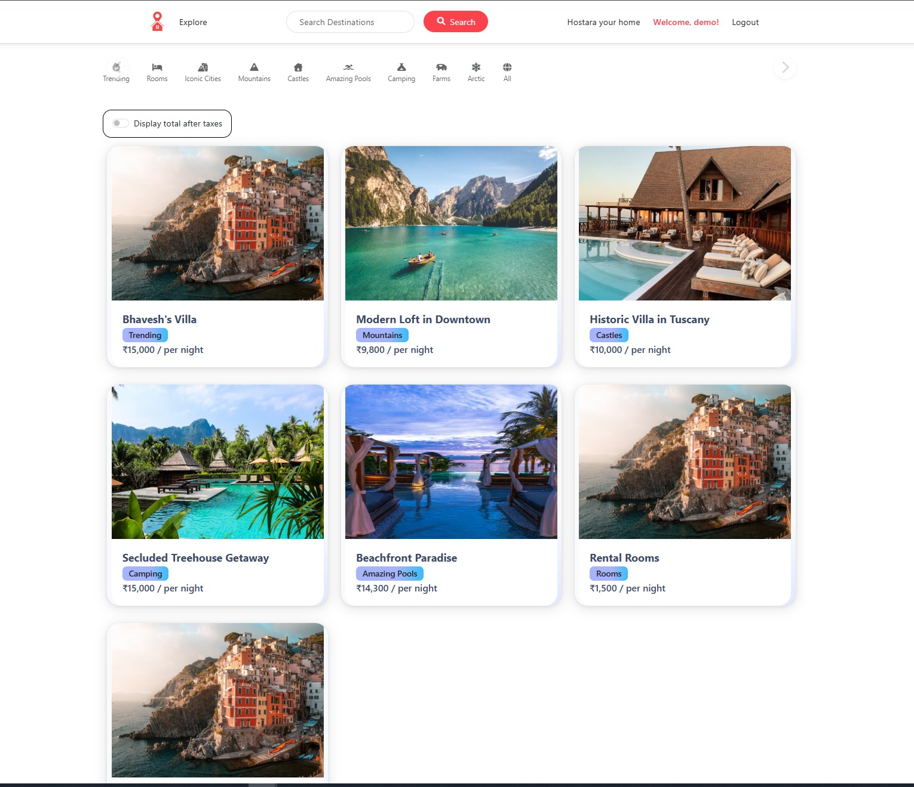

# 🏡 Hostara – Full-Stack Property Rental Platform

> A dynamic Airbnb-inspired full-stack web application built using the **MERN Stack + EJS**, enabling users to explore, list, and review rental properties with a seamless UI/UX.

---

## 🚀 Features

- 🏠 Browse detailed property listings with images and ratings  
- ✍️ Authenticated users can **add reviews** and manage their listings  
- 🔒 Full user authentication using **Passport.js**  
- 🗃️ Clean **MVC architecture** for scalable code management  
- 🌐 Real-time dynamic pages powered by **EJS Templating**  
- 🌟 Flash messages, form validations, and RESTful routing  

---

## 🛠️ Tech Stack

- **Frontend**: EJS, Bootstrap, Vanilla CSS  
- **Backend**: Node.js, Express.js  
- **Database**: MongoDB (via Mongoose)  
- **Authentication**: Passport.js  
- **Cloud Storage**: Cloudinary  
- **Validation**: Joi  
- **Utilities**: dotenv, connect-flash, method-override  

---

## 🧠 Why This Project Matters

- 🔍 Built with **interview-ready structure** (middleware, controllers, schemas)  
- 🧱 Showcases **production-level features**: authentication, CRUD, error handling  
- 🔗 Demonstrates real-world **REST API** practices and MongoDB integration  
- 🧩 Ideal for discussions on **backend architecture** and **scalability**  

---

## 🖥️ Getting Started Locally

```bash
# Clone the repo
git clone https://github.com/Bhavesh-Solminde/Hostara
cd hostara

# Install dependencies
npm install

# Setup environment variables
cp .env.example .env  # then edit .env with your values

# Run the app
node app.js
```
## 📸 Screenshots



---

## 📚 What I Learned

- Designing scalable backend using **modular MVC**  
- Implementing **authentication** and **role-based access** using **Passport.js**
- Handling **form validation** securely  
- Structuring a clean and maintainable codebase  
- Working with **Cloudinary**, **MongoDB**, and **Joi**  

---

## 📇 Credits

Built by **Bhavesh**, aspiring software engineer passionate about full-stack web development, product engineering, and clean architecture.


---

## 📬 Contact

- 📧 Email: bhaveshsolminde@gmail.com 
- 💼 Portfolio: [not yet]
- 🧑‍💻 LinkedIn: (https://www.linkedin.com/in/bhaveshsolminde/)
